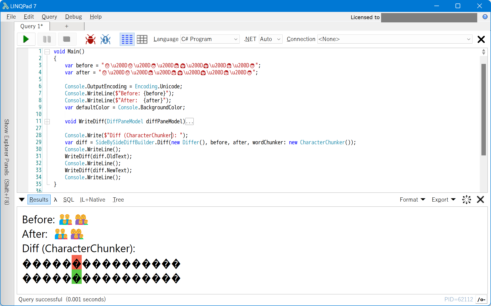
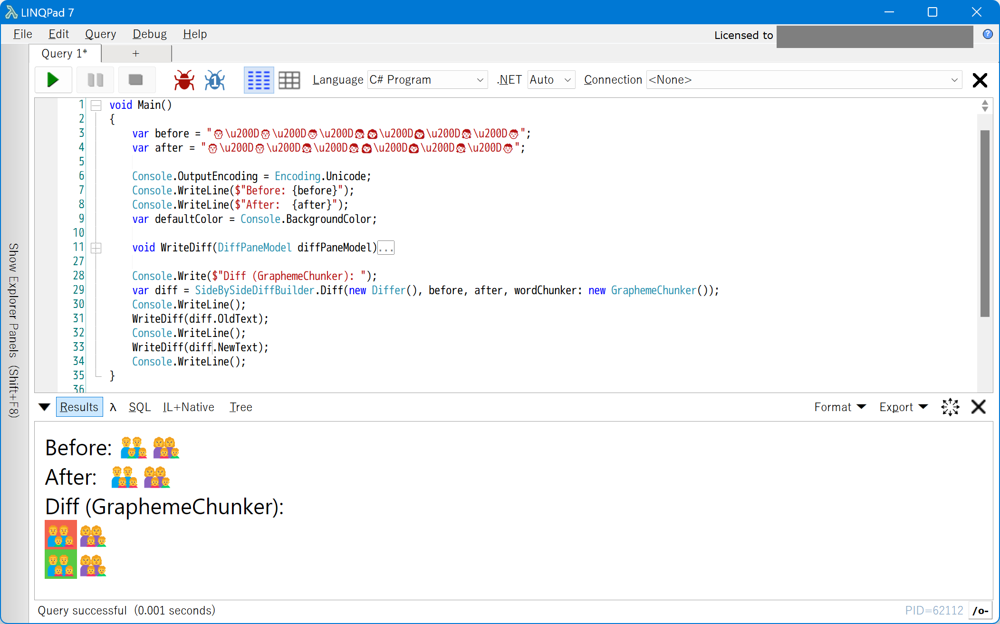

# GraphemeChunker.DiffPlex

An implementation of [DiffPlex](https://github.com/mmanela/diffplex).IChunker that splits string by Unicode grapheme.

CharacterChunker, which is built into DiffPlex, splits by char unit, so surrogate pairs such as some kanji and emoji, and ligatures such as family emoji and country flags are broken apart.

GraphemeChunker splits by Unicode grapheme unit, so those characters that you don't want to be splitted are properly processed as a single part.

## NuGet package

https://www.nuget.org/packages/GraphemeChunker.DiffPlex/

```powershell
Install-Package GraphemeChunker.DiffPlex
```

## Sample Code

```C#
var before = "👨\u200D👨\u200D👦\u200D👧👩\u200D👩\u200D👧\u200D👦";
var after = "👨\u200D👨\u200D👧\u200D👧👩\u200D👩\u200D👧\u200D👦";

Console.OutputEncoding = Encoding.Unicode;
Console.WriteLine($"Before: {before}");
Console.WriteLine($"After:  {after}");
var defaultColor = Console.BackgroundColor;

void WriteDiff(DiffPaneModel diffPaneModel)
{
    foreach (var line in diffPaneModel.Lines)
    {
        foreach (var piece in line.SubPieces)
        {
            Console.BackgroundColor = piece.Type switch
            {
                ChangeType.Inserted => ConsoleColor.Green,
                ChangeType.Deleted => ConsoleColor.Red,
                _ => defaultColor
            };
            Console.Write(piece.Text);
        }

        Console.BackgroundColor = defaultColor;
    }
}

Console.Write($"Diff (GraphemeChunker): ");
var diff = SideBySideDiffBuilder.Diff(new Differ(), before, after, wordChunker: new GraphemeChunker());
Console.WriteLine();
WriteDiff(diff.OldText);
Console.WriteLine();
WriteDiff(diff.NewText);
Console.WriteLine();
```

This sample, there is two emoji that family of four, this is, two graphemes, but is composed of surrogate pairs and ZWJ ligatures, so it counts as 22 characters in UTF-16. If you split it up like this, you'll unfortunately end up being the perpetrator in the emoji families dismembered murder case.



By splitting by grapheme unit, the textual diffs can be displayed without dismembering human bodies or breakup of families.



## Notes

This library uses [GraphemeSplitter](https://github.com/ufcpp/GraphemeSplitter) in lower than .NET 5.0.
In .NET 5.0 or higher, uses [`StringInfo.GetTextElementEnumerator`](https://learn.microsoft.com/dotnet/api/system.globalization.stringinfo.gettextelementenumerator).

GraphemeSplitter does not support splitting multiple consecutive regional indicaters, so they are treated as a single grapheme.
